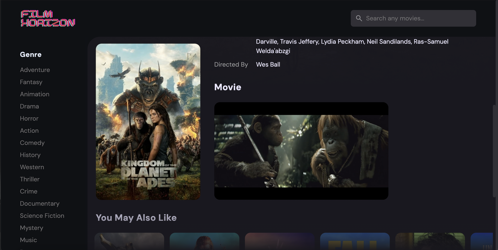

<h1 align='center'>Film Horizon</h1>


<h2>Demo</h2>

🔥 [Live Demo](https://filmhorizon.netlify.app/)

<h2>Techonologies</h2>
<h3>Front-End</h3>

- HTML
- CSS
- JavaScript

<h3>Back-End</h3>

- REST API

<h2>Features</h2>

- Watch any movie you want
- Movie information and screenshots
- Responsive Design
- Filters for genre you want to watch
- High quality with no ads

<h2>Screenshots</h2>





<h2>Development</h2>
ere are the steps to start the project locally.

1. Clone the repository.

```sh
HTTPS - $ git clone https://github.com/tenzinkunchok25/film-horizon.git
or
SSH - $ git clone git@github.com:tenzinkunchok25/film-horizon.git
```

2. Move to the cloned directory.

```sh
$ cd film-horizon
```

3. Open index.html using live server


